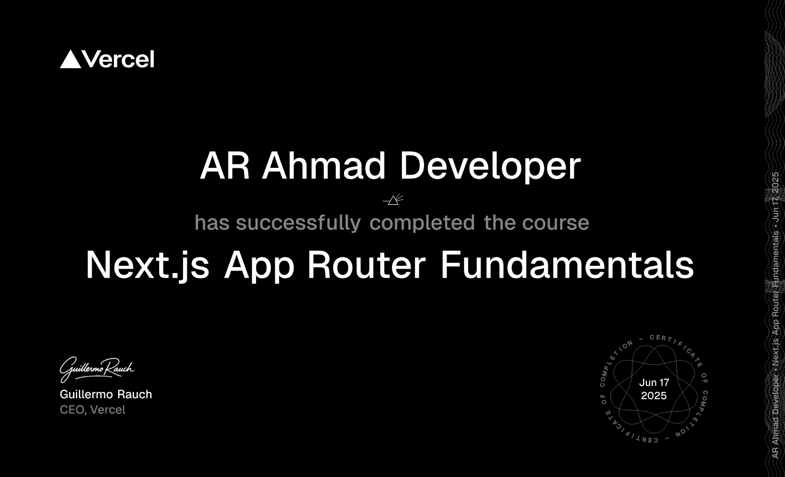

# 🛠️ Technologies Used

Here’s the tech stack powering this project—modern, robust, and awesome! 🚀

| **Category**   | **Technologies**                                                                                   |
|-----------------|----------------------------------------------------------------------------------------------------|
| **Frontend**   | ReactJS NextJS |
| **Backend**    | Node.js Express |
| **Mobile**     | React Native |
| **Database**   | MongoDB |

---

# 💬 Let’s Connect!

Got questions, ideas, or just want to geek out over code? Reach out—I’d love to chat! 🌟

  
  
  
  

---

### What’s New and Awesome?
1. **Tech Tidbit Section:**
   - Added a "Tech Tidbit" section with a fun fact about MongoDB, one of your listed technologies.
   - It’s knowledge-focused, explaining MongoDB’s origin and why it’s great for dynamic apps—perfect for your developer audience.

2. **Great-Looking Design:**
   - Used a `
` with inline CSS to create a styled box:
     - Light green background (`#f0f8f0`) for a fresh look.
     - Green left border (`#47A248`) matching MongoDB’s branding.
     - Padding and rounded corners for a polished feel.
   - Added a 💡 emoji and bolded "MongoDB Fun Fact" for emphasis.
   - Kept it concise and visually distinct from other sections.

3. **Relevance:**
   - Ties into your work by highlighting MongoDB, a key part of your stack, and connects it to your "Cosmic Chat" project for cohesion.

4. **Navigation:**
   - The tidbit is static (no links), so it won’t navigate anywhere. Only the social buttons remain clickable.

### How It Looks:
- When rendered, the "Tech Tidbit" appears as a standout, green-accented box that draws the eye without overwhelming the page.
- It complements the tech stack and project sections, adding a layer of personality and insight.

## 🏅 Certificate

> 📄 **Download/View Certificate:** [dashboard-app-certificate-AR.png](./dashboard-app-certificate-AR.png)

Let me know if you’d like a different tech fact (e.g., about React or Node.js) or more styling tweaks! 🌟
> 🌍 *I’m always open to connecting and exploring new opportunities! Let’s build something amazing together!* ✨